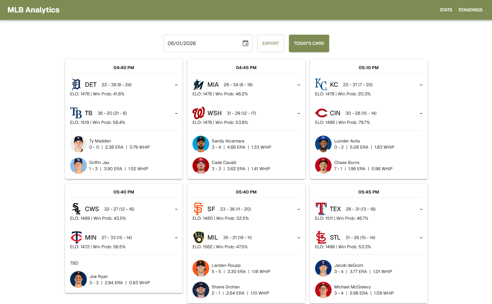
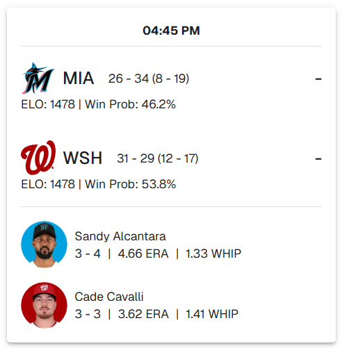
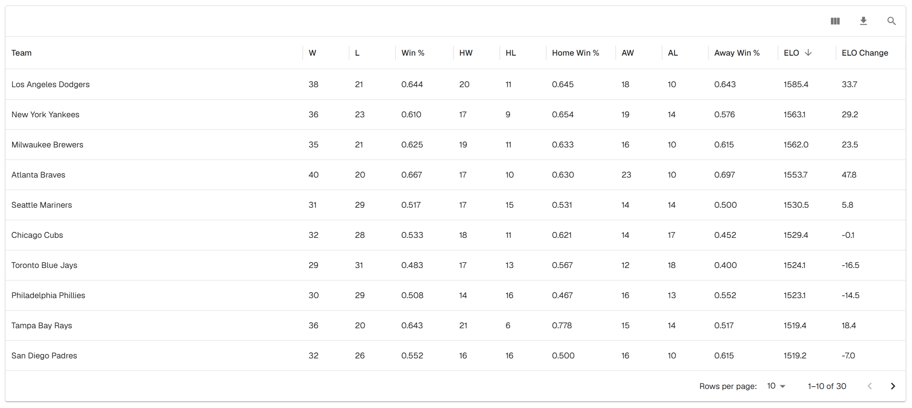
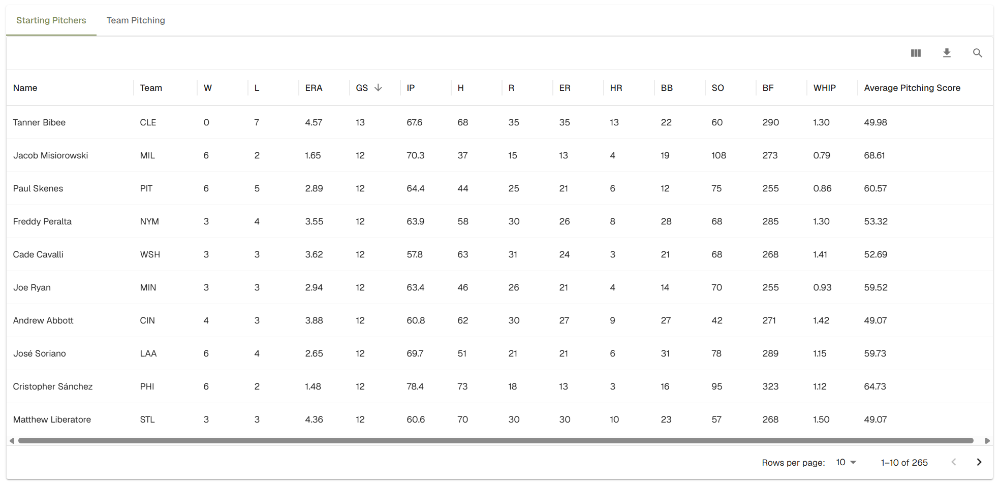
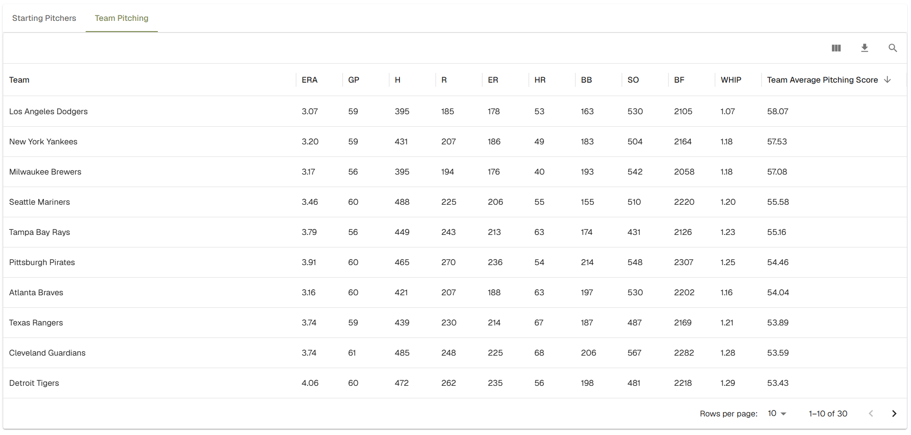
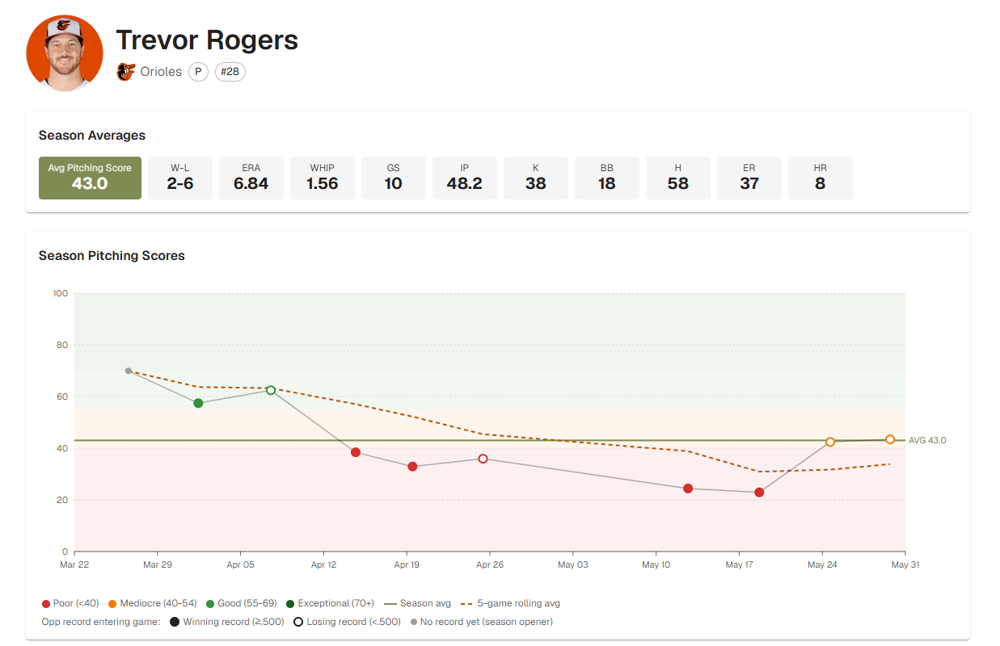
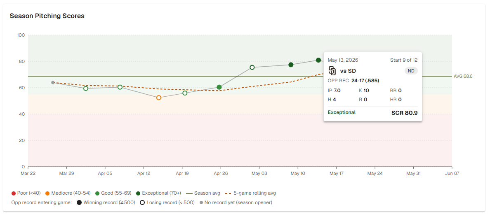
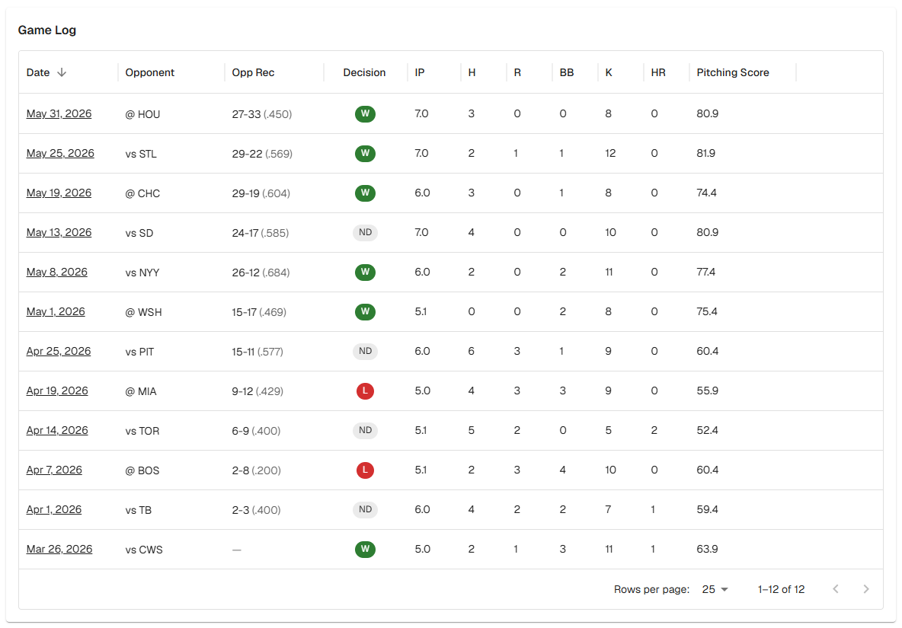

# MLB Daily Analytics
 
A personal sports analytics platform for tracking MLB games, team performance, and pitcher statistics. Built as a hands-on exploration of full-stack engineering, sports data, and AWS deployment — driven by a longtime interest in sports analytics.
 
**Live site:** [jaysonjorgensen.dev](https://jaysonjorgensen.dev)
 

 
---
 
## What it does
 
The application pulls game data, team records, and player statistics from MLB's official API on a scheduled basis, transforms and stores the data in PostgreSQL, and serves it through a Next.js frontend. There are three main areas:
 
### Dashboard
 
A daily view of every MLB game scheduled for the day — matchups, starting pitchers for each side, computed win probabilities derived from team ELO, and final scores once games conclude. Designed to be the page I'd actually open before watching a game.
 

 
### Standings
 
Team records grouped by full league standings, with home/away splits, current ELO rating, and season-long ELO change. The ELO calculation runs after each completed game, adjusting team ratings based on outcome and prior expected win probability. It's a more nuanced view of team strength than win/loss alone — a team with a high ELO and a mediocre record has been losing close games to strong opponents, while a team with a low ELO and a great record has been beating weak teams convincingly. Both stories matter.
 

 
### Stats
 
Pitching-focused statistics covering both individual pitchers and team-level pitching performance. The decision to focus on pitching reflects personal interest — pitching analytics is where most of the interesting modern baseball research happens, and the data is rich enough to be worth digging into.
 

 
The Average Pitching Score column is a custom metric calculated per game and aggregated across the season. Clicking on a pitcher's name opens that pitcher's detail page (see below).
 

 
---
 
## How pitching scores are calculated
 
Every pitcher in the database gets a per-appearance score and a season average. The formula is:
 
```
Score = 47.4 + (1.5 × outs) + strikeouts − (2 × walks) − (2 × hits) − (3 × runs) − (4 × home runs)
```
 
Each component reflects a deliberate weighting choice:
 
- **47.4 baseline** anchors the score so an average outing lands in a familiar range (roughly 50 for a league-average start)
- **+1.5 per out** rewards length — a pitcher who works deep into a game is doing real value
- **+1 per strikeout** rewards dominance independent of defense
- **−2 per walk** penalizes lack of control
- **−2 per hit** penalizes contact allowed
- **−3 per run** penalizes the actual scoring outcome regardless of how it happened
- **−4 per home run** adds an extra penalty for the worst possible outcome of contact
The formula is in the tradition of Bill James's original Game Score metric, with adaptations: the "1 per out + 2 per inning after the 4th" structure of Game Score is collapsed into a flat 1.5-per-out multiplier, and a home run penalty is added because in modern baseball home runs deserve to be tracked as a distinct category, not just absorbed into the runs penalty.
 
For reference, here's roughly how scores translate:
 
| Score | Interpretation |
|-------|----------------|
| 70+ | Exceptional start |
| 55-69 | Good outing |
| 40-54 | Mediocre |
| Below 40 | Poor |
 
The Team Average Pitching Score on the team stats page averages this metric across every starting pitcher appearance for the team. It serves as a rough single-number indicator of starting rotation quality — useful for at-a-glance comparisons that ERA alone can flatten.
 
---
 
## Pitcher detail page
 
Clicking a pitcher's name from the stats table opens a dedicated detail page combining season averages, an interactive D3.js visualization, and a game log. The page is designed to answer the question a scout or analyst would actually ask when looking up a pitcher: "how have they been doing, and how did they get to where they are right now?"
 

 
The page is organized in three layers, ordered from summary to detail:
 
1. **Season averages strip** at the top — the standard stat line (W-L, ERA, WHIP, GS, IP, K, BB, H, ER, HR) plus the season Avg Pitching Score, color-anchored as the headline metric
2. **Season Pitching Scores chart** — the interactive D3.js visualization (described below)
3. **Game log table** — every start of the season with per-game stats, opponent record at the time of the game, decision (W/L/ND), and the per-game Pitching Score
This lets a viewer go from glance ("how's his season?") to investigation ("what happened in that one bad start in May?") without leaving the page.
 
### The season scores chart
 
The D3.js chart is the centerpiece of the page. Several deliberate design choices are doing work in it:
 

 
**Quality bands as background color.** Each score range (Exceptional, Good, Mediocre, Poor) has its own subtle background band. The viewer doesn't need to read y-axis values to understand a point's quality — the color it sits on tells them. Points are also colored by tier so the legend is consistent whether you're looking at the dot or the band it lives in.
 
**Season average as a solid horizontal line.** Gives an immediate anchor: "this pitcher's overall season has been X." The label sits at the right edge of the chart for easy reading.
 
**5-game rolling average as a dashed line.** Smooths out single-start noise and reveals trend. When the dashed line slopes up over a few starts, the pitcher's been on a hot streak; when it dips, the opposite. The rolling average is more useful for "are they trending up or down right now?" than the season average is.
 
**Filled vs. hollow markers indicate opponent strength.** Each point's appearance encodes the opponent's record entering that game. A filled circle means the opponent was a winning team at the time (≥.500). A hollow circle means the opponent was below .500. This is a binary signal at the most meaningful threshold in baseball, and it changes how you read the chart at a glance — performances against winning teams carry analytical weight that the same score against a losing team doesn't. Detailed records are still available in the tooltip and game log.
 
**Interactive tooltips on hover.** Each point reveals the date, opponent (with team logo and W/L outcome), the opponent's record entering the game, and the full stat line that produced that score — innings pitched, strikeouts, walks, hits, runs, and home runs allowed. This turns the chart from a summary into an investigative tool: spot an outlier point, hover, see exactly what happened in that game.
 
### How the 5-game rolling average is computed
 
For each start, the rolling average value is the mean of that start's score plus the four previous starts (a trailing window of 5).
 
| Plotted at | Window of games averaged |
|------------|--------------------------|
| Start 5    | Games 1–5                |
| Start 6    | Games 2–6                |
| Start 7    | Games 3–7                |
| ...        | ...                      |
| Start 12   | Games 8–12               |
 
For the first four starts of the season there aren't five prior games yet, so the window expands to use whatever is available:
 
| Plotted at | Actually averaging       |
|------------|--------------------------|
| Start 1    | Game 1 only              |
| Start 2    | Games 1–2                |
| Start 3    | Games 1–3                |
| Start 4    | Games 1–4                |
| Start 5+   | Trailing 5 games         |
 
This is a common convention in time-series smoothing — it lets the trend line cover the entire season rather than starting partway through. The tradeoff is that the early points on the rolling line are noisier (an average of 1-3 games is essentially the raw value), but the alternative of leaving the first four starts uncovered is visually worse and makes the chart harder to read.
 
### How opponent strength is computed
 
The opponent's record entering each game is computed on-demand from the underlying game history, not from a snapshot field. For each game in the pitcher's history, the query looks at all completed games for the opponent team with dates before this game's date, then aggregates wins and losses.
 
This approach was chosen deliberately. Current-day stats (the Yankees' record today) don't accurately represent what a team's record was at the time of a past matchup — a team that's 30-30 today might have been 22-12 in April when this game was played. Computing the record-to-date from underlying game data gives a temporally accurate metric without requiring snapshot fields in the database.
 
The game log table below the chart shows each opponent's record-at-time formatted as `24-17 (.585)` for precise lookup. The chart marker encoding (filled vs. hollow) reduces this to the binary signal needed at a glance.
 

 
---

## Tech stack
 
**Frontend:** Next.js, React, TypeScript, Styled Components, D3.js
**Backend:** Next.js API routes, Prisma ORM
**Database:** PostgreSQL
**Infrastructure:** Docker, AWS (ECS Fargate, ECR, RDS, ACM, Application Load Balancer), Cloudflare DNS
**CI/CD:** GitHub Actions
**Data source:** MLB's official statistics API

---
 
## Architecture
 
```
MLB Official API
       │
       ▼
Scheduled ingestion jobs ──► Data transformation ──► PostgreSQL (Prisma)
                                                            │
                                                            ▼
                                          Next.js API routes (TypeScript)
                                                            │
                                                            ▼
                                              React frontend (4 main views)
```
 
Game data and box scores are pulled on a schedule. Lineups and starting pitchers update throughout the day; completed games are processed in the evening, triggering ELO updates, team record adjustments, and per-game statistical aggregation into season-long stats. The Next.js application serves both the API layer and the rendered frontend from a single Docker container deployed to AWS ECS Fargate.

---

## Deployment
 
The application is deployed to AWS with automated CI/CD:
 
- **GitHub Actions** triggers on push to `main`, builds the Docker image, pushes to ECR, and triggers an ECS redeployment
- **ECR** for the Docker image registry
- **ECS Fargate (Express Mode)** for the container runtime, with canary deployments and an automatic rollback circuit breaker
- **Application Load Balancer** routing public traffic, with multi-cert SNI for both the auto-generated AWS hostname and the custom domain
- **RDS PostgreSQL** for the database
- **ACM** for the TLS certificate
- **Cloudflare** for DNS
The Dockerfile uses a multi-stage build with Next.js's standalone output to keep the production image lean. Database credentials are injected at the container level rather than baked into the image. Scheduled cron jobs run in-process via node-cron, initialized through Next.js instrumentation at server startup.

---

## What's next
 
- **Comparison views** between two pitchers on the same chart — overlay two season-long score lines to instantly compare trajectories
- **Expanded hitting stats.** Pitching has been the focus so far; hitting metrics are on the roadmap
- **Historical comparisons.** Year-over-year and rolling-window views for team and player performance

---

## Why I built this

I love sports, and I've spent more hours than I'd care to admit doing ad-hoc analysis in Google Sheets. This project is the natural progression — taking the analysis I'd do anyway and turning it into actual software. It's also been a chance to work end-to-end across a stack I don't always get to touch in my day job: data ingestion at scale, ELO modeling, custom statistical formulas, D3.js visualization, Docker, AWS infrastructure, CI/CD.
